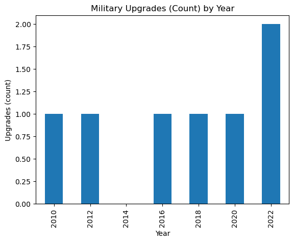

# Arctic Analysis Starter (Template)

This repository contains a starter data science project using Python, Jupyter, and sample Arctic shipping data.  
You can rename this project and replace the sample data with your own.
> 
> ## What's Inside
- **notebooks/01_arctic_demo.ipynb** → Demo analysis notebook with simple data cleaning and visualization.  
- **data/sample_arctic.csv** → Example dataset for practice.  
- **src/** → Helper functions for loading data.  
- **.github/workflows/** → GitHub Actions to automatically run notebooks on every push.  
## Demo Output
Here’s a preview chart generated by the demo notebook:



## Quickstart

**Option A — GitHub Desktop (easiest)**  
1. Create a new GitHub repository in your account (no files yet).
2. Click **"Open with GitHub Desktop"** (or clone it later).
3. Unzip this template locally and copy its contents into your repo folder.
4. GitHub Desktop → **Commit** → **Push origin**.

**Option B — Command Line**
```bash
# From inside the repo folder you cloned
python -m venv .venv
# Windows: .venv\Scripts\activate
# macOS/Linux:
source .venv/bin/activate

pip install -r requirements.txt

# Launch Jupyter
jupyter notebook
```

Open `notebooks/01_arctic_demo.ipynb`, run all cells, and push your changes.

## Project Structure

```
.
├── README.md
├── requirements.txt
├── environment.yml
├── LICENSE
├── .gitignore
├── data
│   ├── sample_arctic.csv
│   ├── processed/        # .gitkeep to track empty dir
│   └── raw/              # .gitkeep to track empty dir
├── notebooks
│   └── 01_arctic_demo.ipynb
├── src
│   └── data_utils.py
└── .github
    └── workflows
        └── run-notebooks.yml
```

## Reproduce the Analysis

1. Create and activate the virtual environment (see **Quickstart**).
2. `pip install -r requirements.txt`
3. `jupyter notebook` → open and run `notebooks/01_arctic_demo.ipynb`.

The demo notebook uses a small sample dataset (`data/sample_arctic.csv`) to create basic
exploratory plots for **Northern Sea Route transits** and **military upgrades** by year.

## Results

- Executed notebooks will be saved by the GitHub Action to `executed_notebooks/` on CI.
- You can attach screenshots of charts or export images to include in your README.

## Next Steps

- Replace `data/sample_arctic.csv` with your real dataset(s).
- Duplicate the notebook to start new analyses (`02_*`, `03_*`).
- Update the README with your project objective, methods, and key findings.
- Add a link to this repo from your LinkedIn and later your full portfolio.

## License

This template is provided under the MIT License (see `LICENSE`).
